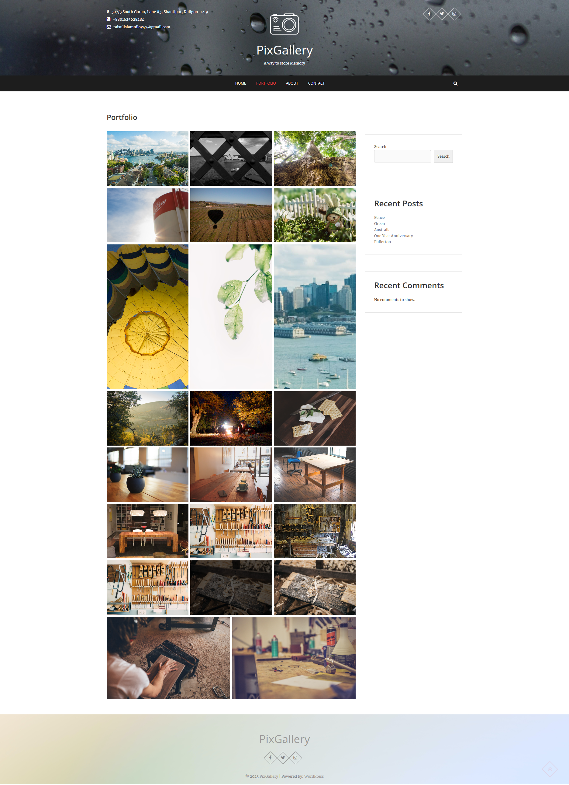
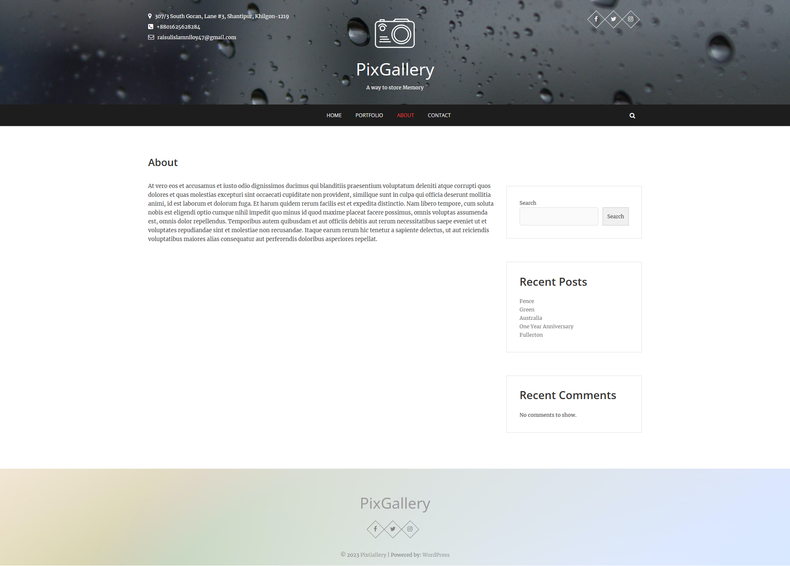
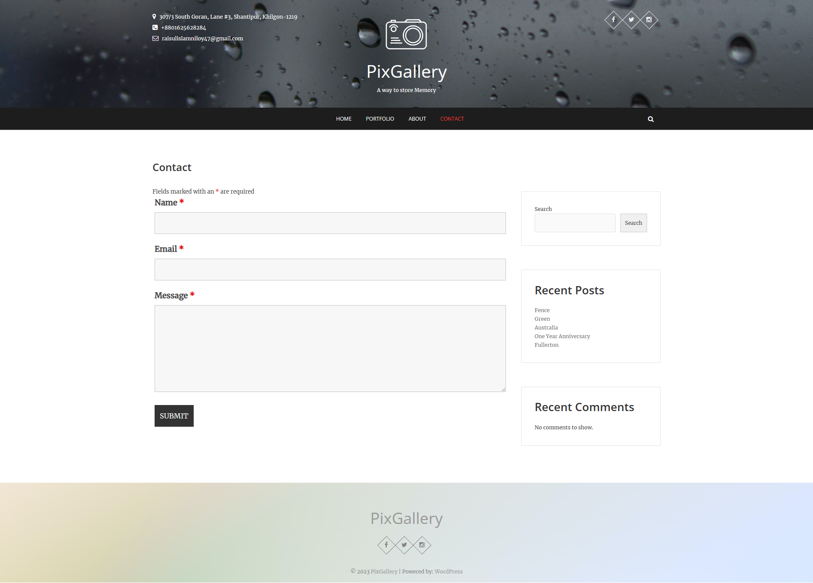

PixGallery Website - Technical Documentation
=========================================================

Table of Contents
-----------------

1.  Introduction
2.  Key Features
3.  Theme and Plugins
4.  Icons and Images
5.  WordPress Theme - Pixgraphy
6.  Plugins
    -   Jetpack
    -   Ninja Forms

* * * * *

1\. Introduction
----------------

Welcome to the technical documentation for PixGallery, a photo gallery website built using WordPress. This document provides an overview of the components used to create the website, including the theme, plugins, icons, and images. If you're looking to understand the technical aspects of PixGallery.it, you're in the right place.

2\. Key Features
---------------------

#### HOME

The `Home` page of the website functions as the principal interface for PixGallery, where visual content is emblematic of blog-style entries.

#### PORTFOLIO

The `PORTFOLIO` page of the website showcases an assorted compilation of photographs, presented in distinct thematic collections.

#### ABOUT Page

The `ABOUT` page on the website serves as a comprehensive platform, providing visitors with insight into the origins, mission, and artistic principles that underpin PixGallery.

#### CONTACT Page

The `CONTACT` page serves as a dedicated interface for users to initiate communication with PixGallery, facilitating seamless interaction and inquiries regarding the platform's content, services, and collaborations.

3\. Theme and Plugins
---------------------

### Theme: Pixgraphy

-   Theme URL: [Pixgraphy](https://wordpress.org/themes/pixgraphy/)

### Plugins

#### Jetpack

-   Plugin URL: [Jetpack](https://wordpress.org/plugins/jetpack/)

#### Ninja Forms

-   Plugin URL: [Ninja Forms](https://wordpress.org/plugins/ninja-forms/)

4\. Icons and Images
--------------------

### Icons

-   Icon Source: [Iconfinder](https://www.iconfinder.com/)

### Images

-   Image Source: [Pexels](https://www.pexels.com/)

5\. WordPress Theme - Pixgraphy
-------------------------------

Pixgraphy is the core theme that defines the visual and layout characteristics of PixGallery.it. Some notable features of the Pixgraphy theme include:

-   Responsive design: Ensures the website looks and functions well on various devices, including desktops, tablets, and smartphones.
-   Customization options: Provides settings to personalize colors, typography, header layout, and more, allowing you to tailor the website's appearance to your preferences.
-   Image-focused design: Built with imagery in mind, Pixgraphy's layout is optimized for showcasing photos and galleries.
-   Widget areas: Offers widgetized areas that allow you to add various elements such as sidebars, footers, and more.

6\. Plugins
-----------

### Jetpack

Jetpack is a multifunctional plugin that enhances PixGallery.it in several ways:

-   Performance: Utilizes a Content Delivery Network (CDN) to accelerate image loading times, reducing page load times and improving user experience.
-   Security: Implements security measures such as brute force attack protection, downtime monitoring, and malware scanning to safeguard the website.
-   Sharing and Engagement: Adds social media sharing buttons to images and content, enabling users to easily share your visual content across platforms.
-   Statistics: Provides detailed insights into the website's traffic, helping you understand user behavior and engagement.

### Ninja Forms

Ninja Forms adds valuable form-building capabilities to PixGallery.it:

-   Form Creation: Enables the creation of customizable forms, such as contact forms, feedback forms, and surveys, to engage with users effectively.
-   Drag-and-Drop Interface: Offers an intuitive interface for designing forms without requiring coding skills.
-   Email Notifications: Sends email notifications upon form submissions, ensuring prompt responses to user interactions.
-   Data Management: Allows for data collection and management directly within the WordPress dashboard.

7\. Installation and Setup
-----------

To set up the PixGallery website on your local machine, follow these steps:

1\. Clone the repository from GitHub: `git clone https://github.com/Raisenil/PixGallery.git`

2\. Download and install XAMPP from the official website `(https://www.apachefriends.org/index.html)`. Follow the installation instructions for your operating system.

3\. Make sure XAMPP is up and running. Start the Apache and MySQL modules from the XAMPP control panel.

4\. Create a New Database by going On the `phpMyAdmin` interface, click on "New" in the left sidebar to create a new database.
Enter name as `pixgallery` and choose the appropriate collation (usually utf8_general_ci).

5\. Import the Backup by selecting it from the left sidebar. Click on the "Import" tab in the top menu. Click the "Choose File" button to select the .sql backup file from `Database\pixgallery.sql`.Choose the default settings or adjust them based on your needs.Click the "Go" button to start the import process.

6\. Access the website in your browser at `http://localhost:3000`.

* * * * *

This concludes the technical documentation for PixGallery. By combining the Pixgraphy theme, Jetpack, Ninja Forms, Iconfinder, and Pexels,  a successfully visually appealing and functional photo gallery website was made. The chosen components work together to create an engaging user experience, while the theme and plugins offer customization and optimization options to ensure the website's success.